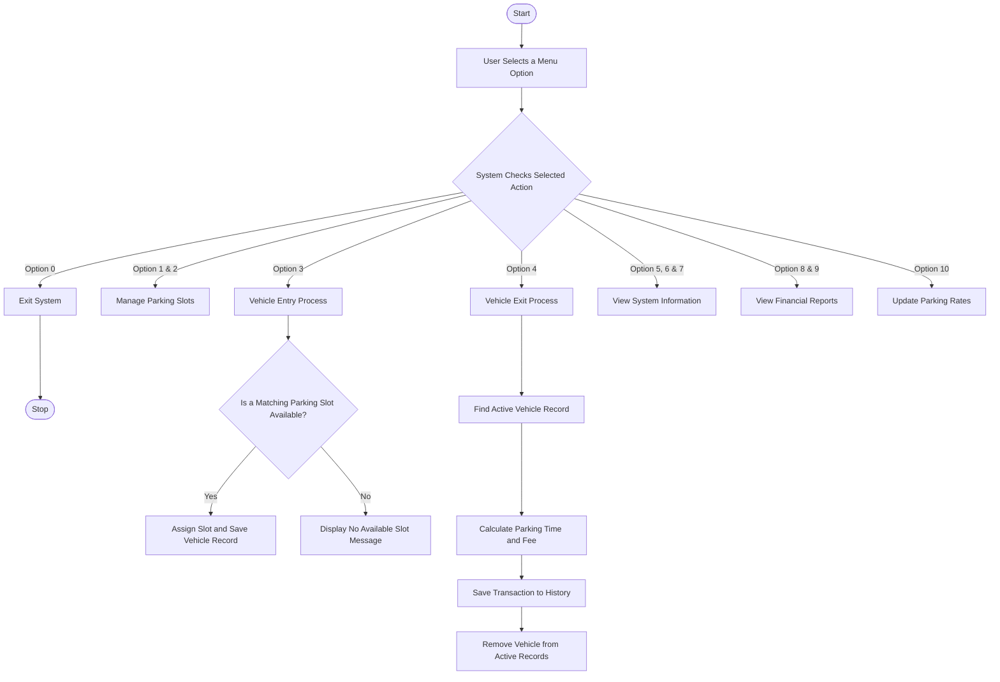

# Architectural Sequence Workflow Logic

```mermaid
graph TD
    START([Start]) --> A[User Selects a Menu Option]

    A --> B{System Checks Selected Action}

    B -->|Option 0| Z[Exit System]
    Z --> STOP([Stop])

    B -->|Option 1 & 2| C[Manage Parking Slots]
    B -->|Option 3| D[Vehicle Entry Process]
    B -->|Option 4| E[Vehicle Exit Process]
    B -->|Option 5, 6 & 7| F[View System Information]
    B -->|Option 8 & 9| G[View Financial Reports]
    B -->|Option 10| H[Update Parking Rates]

    D --> I{Is a Matching Parking Slot Available?}
    I -->|Yes| J[Assign Slot and Save Vehicle Record]
    I -->|No| K[Display No Available Slot Message]

    E --> L[Find Active Vehicle Record]
    L --> M[Calculate Parking Time and Fee]
    M --> N[Save Transaction to History]
    N --> O[Remove Vehicle from Active Records]
```