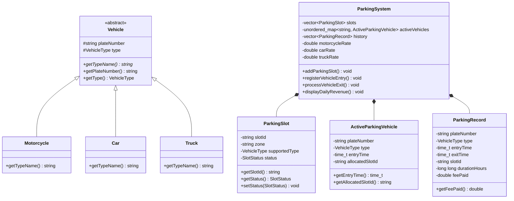

# Domain Object Model Class Layout Definition Diagram

```mermaid
classDiagram
    class Vehicle {
        <<abstract>>
        #string plateNumber
        #VehicleType type
        +getTypeName() string*
        +getPlateNumber() string
        +getType() VehicleType
    }
    class Motorcycle { +getTypeName() string }
    class Car { +getTypeName() string }
    class Truck { +getTypeName() string }

    Vehicle <|-- Motorcycle
    Vehicle <|-- Car
    Vehicle <|-- Truck

    class ParkingSlot {
        -string slotId
        -string zone
        -VehicleType supportedType
        -SlotStatus status
        +getSlotId() string
        +getStatus() SlotStatus
        +setStatus(SlotStatus) void
    }

    class ActiveParkingVehicle {
        -string plateNumber
        -VehicleType type
        -time_t entryTime
        -string allocatedSlotId
        +getEntryTime() time_t
        +getAllocatedSlotId() string
    }

    class ParkingRecord {
        -string plateNumber
        -VehicleType type
        -time_t entryTime
        -time_t exitTime
        -string slotId
        -long long durationHours
        -double feePaid
        +getFeePaid() double
    }

    class ParkingSystem {
        -vector~ParkingSlot~ slots
        -unordered_map~string, ActiveParkingVehicle~ activeVehicles
        -vector~ParkingRecord~ history
        -double motorcycleRate
        -double carRate
        -double truckRate
        +addParkingSlot() void
        +registerVehicleEntry() void
        +processVehicleExit() void
        +displayDailyRevenue() void
    }

    ParkingSystem *-- ParkingSlot
    ParkingSystem *-- ActiveParkingVehicle
    ParkingSystem *-- ParkingRecord
```